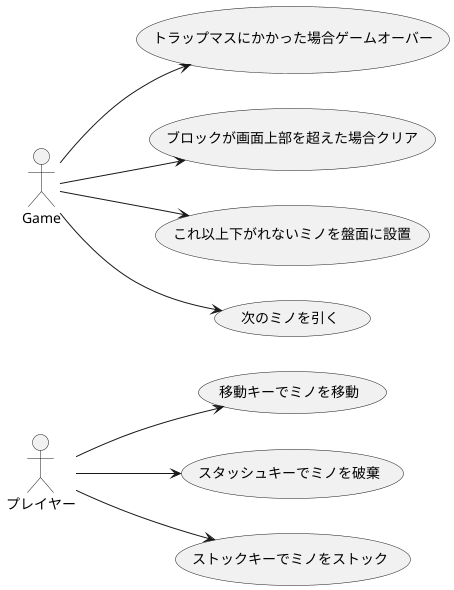

```plantuml
@startuml
left to right direction

"プレイヤー" as :Player: 
:Player: --> (MoveMino)
:Player: --> (Stash)
:Player: --> (Stock)
"移動キーでミノを移動" as (MoveMino)
"スタッシュキーでミノを破棄" as (Stash)
"ストックキーでミノをストック" as (Stock)

:Game: --> (Trap)
:Game: --> (Clear)
:Game: --> (DownLimit)
:Game: --> (DrawMino)
"トラップマスにかかった場合ゲームオーバー" as (Trap)
"ブロックが画面上部を超えた場合クリア" as (Clear)
"これ以上下がれないミノを盤面に設置" as (DownLimit)
"次のミノを引く" as (DrawMino)
@enduml
```
